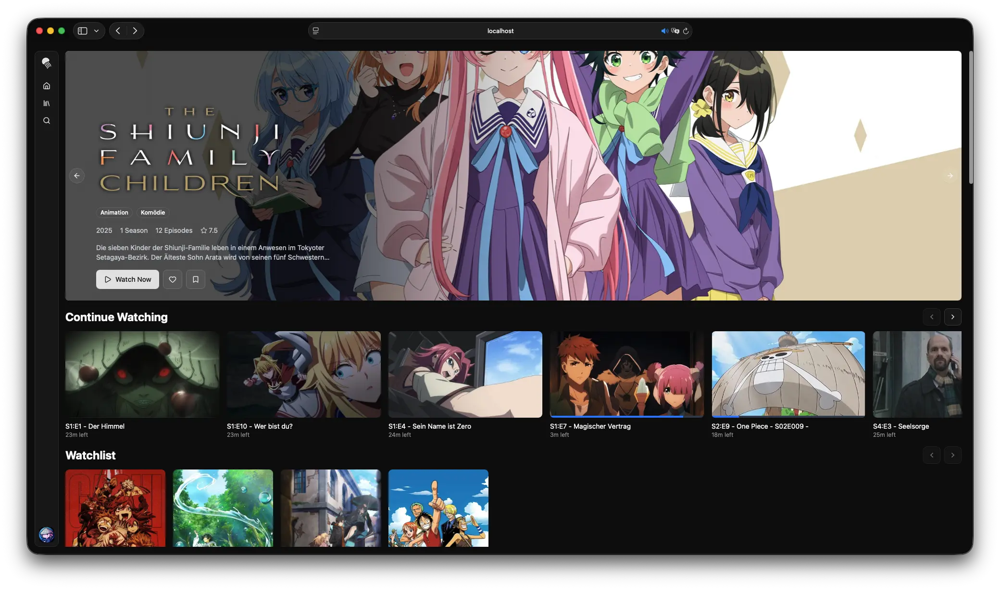
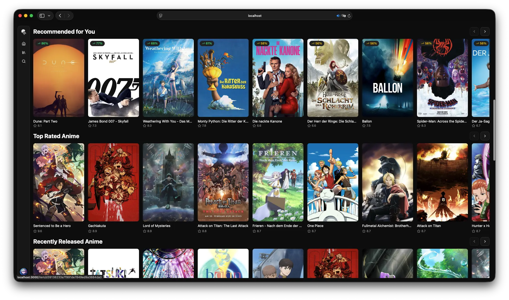
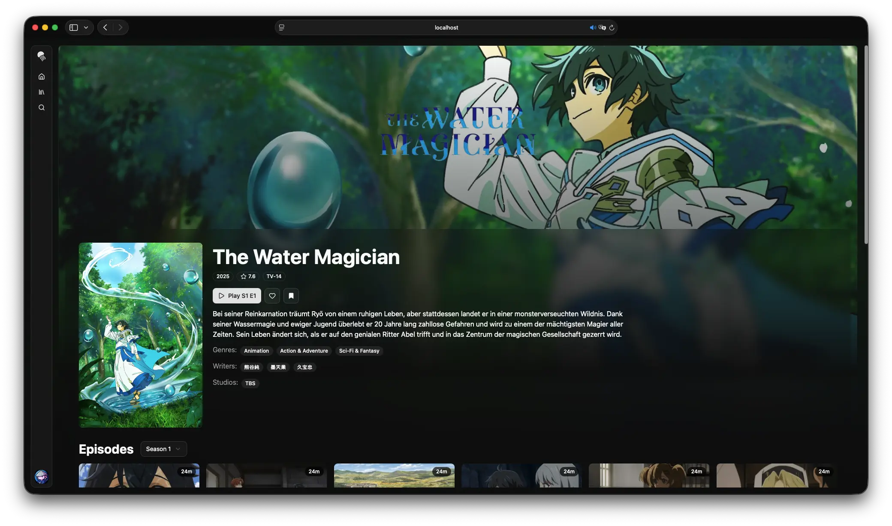
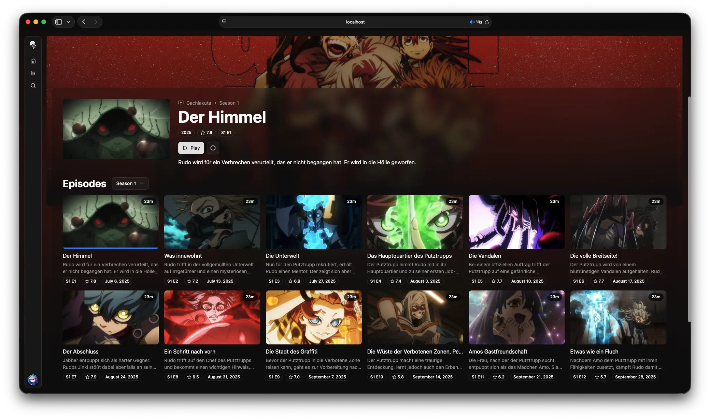
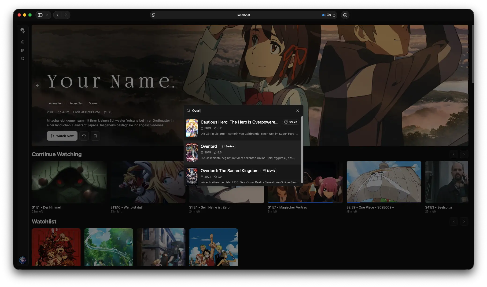

# Pelagica

Pelagica is an alternative web frontend for [Jellyfin](https://jellyfin.org) built using React. It aims to provide a fast, modern, and customizable user experience for browsing and watching your media library.



## Features

- **Customizable Sections:** Tailor your homepage with sections like "Continue Watching", "Recently Added", or completely custom queries.
- **Media Bars:** Add custom media bars to feature specific content.
- **Search:** Quickly find media across your library from anywhere using `Cmd+K` / `Ctrl+K`.
- **Video Player:** Integrated video player for movies and TV shows.
- **Responsive Design:** Works seamlessly on both desktop and mobile devices.
- **Theming:** Light and dark mode support.
- **Localization:** Supports multiple languages through [community contributions](https://gitlocalize.com/repo/10631).

### Integrated Services

- **Streamystats:** Get your streamystats recommendations directly on your home page. 
- **kefintweaks Watchlist:** View and manage your kefintweaks watchlist within Pelagica.

### Screenshots

<table>
  <tr>
    <td>
      
    </td>
    <td>
      
    </td>
  </tr>
  <tr>
    <td>
      
    </td>
    <td>
      
    </td>
  </tr>
</table>

> Screenshots may include media artwork used for demonstration purposes only.

## Docker Installation

The easiest way to run Pelagica is using Docker. This provides a production-ready setup with nginx web server.

### Quick Start

1. **Create a directory for Pelagica:**

    ```bash
    mkdir -p pelagica && cd pelagica
    ```

2. **Download default config files:**

    ```bash
    curl -o config.json https://raw.githubusercontent.com/KartoffelChipss/pelagica/main/public/config.json
    curl -o config.schema.json https://raw.githubusercontent.com/KartoffelChipss/pelagica/main/public/config.schema.json
    ```

3. **Run the container:**

    ```bash
    docker run -d \
      --name pelagica \
      -p 8080:80 \
      -v "$(pwd)/config.json:/usr/share/nginx/html/config.json" \
      -v "$(pwd)/config.schema.json:/usr/share/nginx/html/config.schema.json" \
      --restart unless-stopped \
      kartoffelchipss/pelagica:latest
    ```

4. **Access Pelagica:**
   Open your browser to http://localhost:8080

### Configuration

The `config.json` file in your directory controls the app's behavior. Edit it with any text editor - changes take effect immediately without restarting the container.

**Example: Set default Jellyfin server:**

```json
{
  "$schema": "./config.schema.json",
  "serverAddress": "https://jellyfin.example.com",
  ...
}
```

After editing `config.json`, refresh your browser to see the changes.

### Container Management

```bash
# View logs
docker logs -f pelagica

# Stop the container
docker stop pelagica

# Start the container
docker start pelagica

# Update to latest version
docker pull kartoffelchipss/pelagica:latest
docker stop pelagica
docker rm pelagica
# Then run the docker run command again from Quick Start
```

### Using Docker Compose

If you prefer using docker-compose, create a `docker-compose.yml` file:

```yaml
version: '3.8'

services:
    pelagica:
        image: kartoffelchipss/pelagica:latest
        container_name: pelagica
        ports:
            - '8080:80'
        volumes:
            - ./config.json:/usr/share/nginx/html/config.json
            - ./config.schema.json:/usr/share/nginx/html/config.schema.json
        restart: unless-stopped
```

Then run: `docker-compose up -d`

### Building from Source

If you want to build the Docker image from source instead of using prebuilt images:

```bash
# Clone the repository
git clone https://github.com/KartoffelChipss/pelagica.git
cd pelagica

# Build and start
docker-compose up -d --build
```

Your `config.json` in the project root will be used automatically.

## Development Setup

For local development without Docker:

1. **Install dependencies:**

    ```bash
    pnpm install
    ```

2. **Start development server:**

    ```bash
    pnpm dev
    ```

3. **Access at:** http://localhost:3000

## Localization

Pelagica supports multiple languages and depends on community contributions for translations. If you'd like to help translate Pelagica into your language, you can contribute via [GitLocalize](https://gitlocalize.com/repo/10631).

## Contributing

Issues and pull requests are welcome.
Please open an issue to discuss larger changes before submitting a PR.

## What does that name mean?

You might be wondering about the name "Pelagica". Since I didn't want to call it the usual "\*fin" or "jelly\*" names, I looked for synonyms related to the sea. "Pelagic" refers to living in the deep ocean, which felt fitting for a Jellyfin frontend.

## Acknowledgements

Pelagica’s design was inspired by the [finetic](https://github.com/AyaanZaveri/finetic) Jellyfin frontend.  
No code was used; this project is an independent implementation.

## Disclaimer

This project is a third-party frontend for Jellyfin and is not affiliated with the Jellyfin project.

Jellyfin is a media server designed to organize and stream legally obtained media. This project does not provide, host, or encourage access to pirated content.

The movie posters and images shown in the examples are not owned by me and are only used for demonstration purposes. All rights belong to their respective owners.

## License

This project is licensed under the GNU General Public License v3.0 - see the [LICENSE](./LICENSE) file for details.
